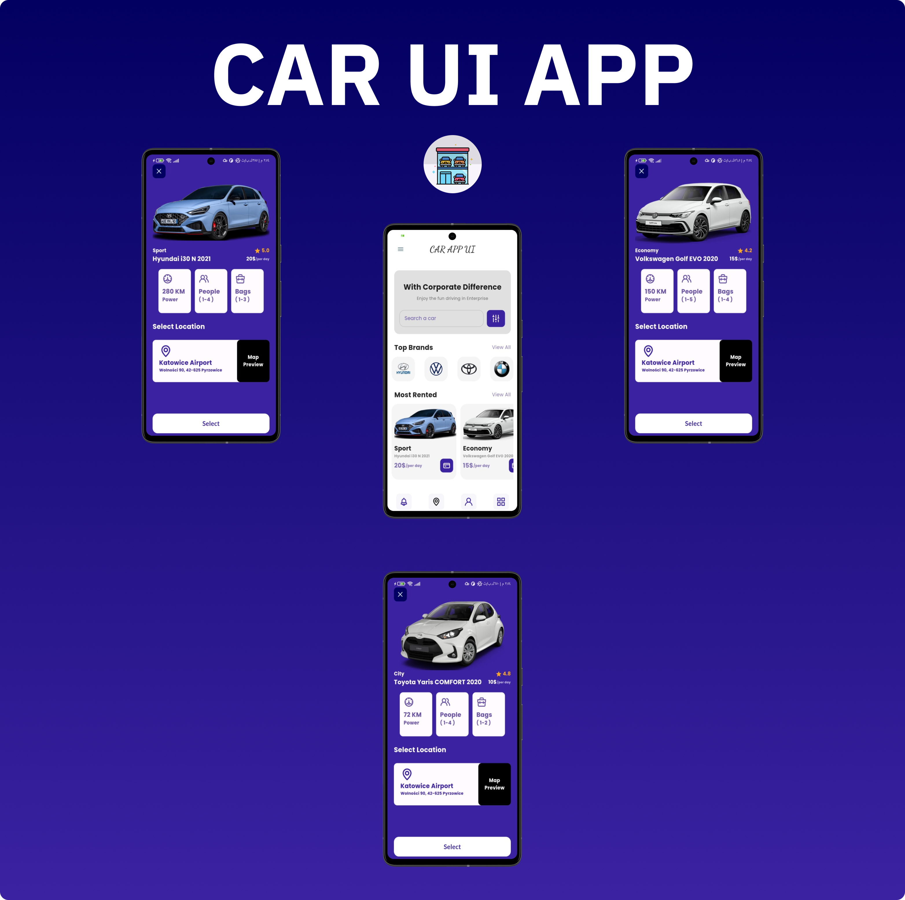

# Car UI App

## Getting Started
This is a simple app about car ui app design

## Plugins
- Google fonts "package"
- Get (Animation) "package"
- Unicons (App icons) "package"
- Material3

## How to use this app
- You can install application in your device via this repo
```bash
git clone https://github.com/klilmhdi/car-app-ui.git
cd car-app-ui
flutter pub get // install plugins
flutter run
```
